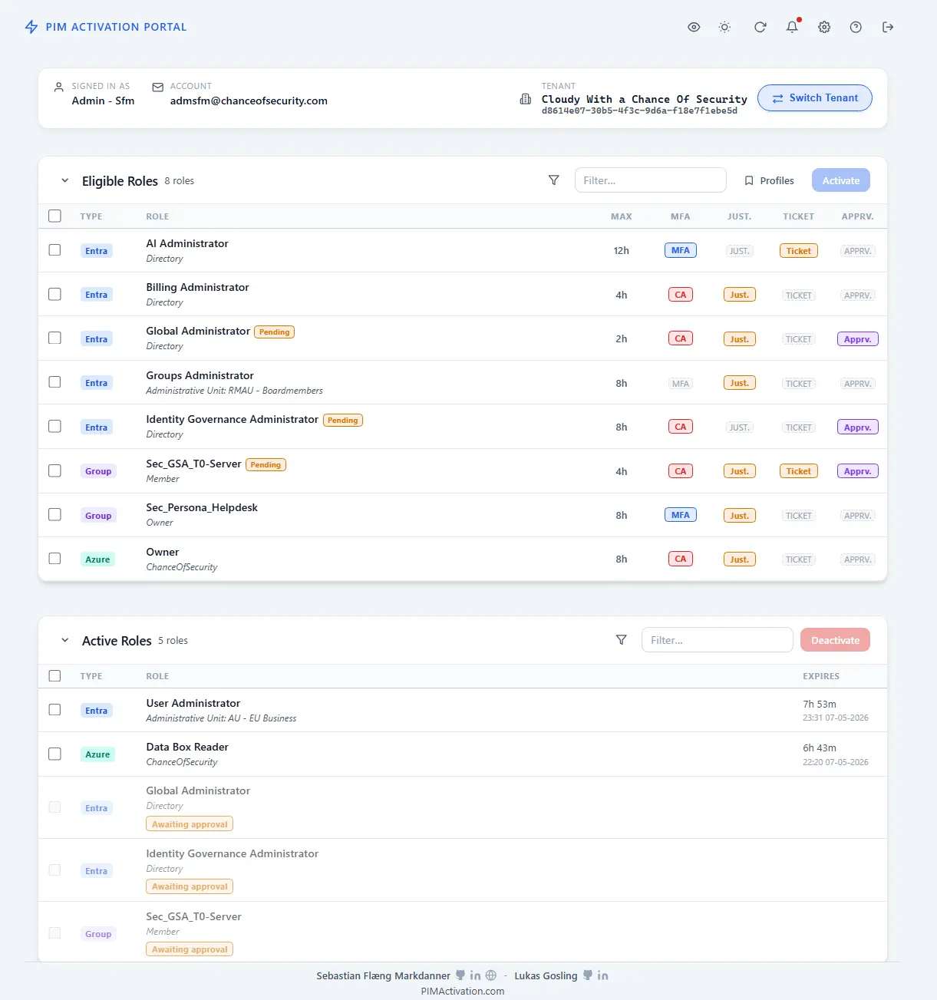
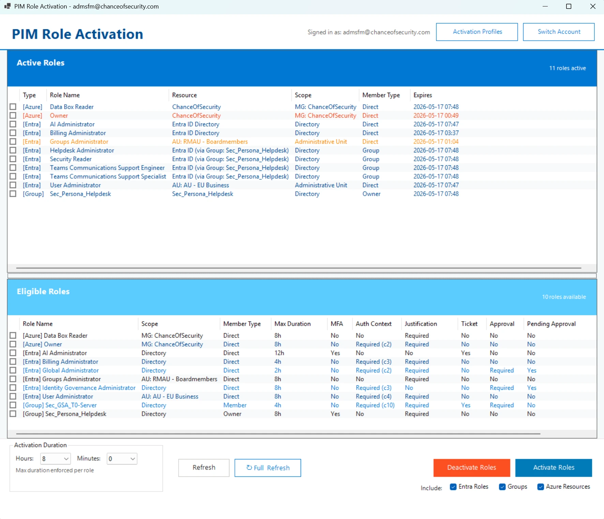

# PIMActivation Portal

> **Browser-based companion to the [PIMActivation PowerShell module](https://github.com/Noble-Effeciency13/PIMActivation).**
> Bulk PIM activation across Microsoft Entra ID roles, Azure Resource roles, and PIM for Groups — in any modern browser, with no backend, no proxy, and no PowerShell required.

[](LICENSE)
[](https://portal.pimactivation.com)
[](https://portal.pimactivation.com)
[](https://www.powershellgallery.com/packages/PIMActivation)
[](https://github.com/Noble-Effeciency13/PIMActivation-Portal/issues)
[](https://github.com/Noble-Effeciency13/PIMActivation-Portal/discussions)

> First public release. The portal is live at **<https://portal.pimactivation.com>** and the self-hosted Bicep / ARM template is ready for deployment into your own Azure tenant.



---

## The idea

Managing Privileged Identity Management activations across three separate planes — Entra ID roles, Azure Resource roles, and PIM for Groups — usually means context-switching between the Azure portal, the Entra admin center, and several approval flows. The PIMActivation ecosystem started as a PowerShell module to collapse that into one command. The portal extends the same model to the browser: select any combination of eligible roles across all three planes, fill in the policy-required fields once, and activate them in a single bulk operation.

The portal is a pure single-page application. There is no backend, no proxy, and no server-side session. Every API call goes directly from your browser to Microsoft's own endpoints — Microsoft Graph for Entra and Group PIM, Azure Resource Manager for Resource PIM. Authentication is handled entirely in-browser by [MSAL.js](https://github.com/AzureAD/microsoft-authentication-library-for-js) using the OAuth 2.0 authorization code flow with PKCE. Tokens live in `sessionStorage` and disappear when you close the tab.

---

## Highlights

- **Bulk activation across all three PIM planes** in one operation
- **Policy-aware** — per-role requirements (justification, ticket, MFA, auth context, approval, max duration) detected and enforced before submit
- **Conditional Access ready** — claims challenges (`acrs`) handled with a re-auth, then threaded through every subsequent token request in the operation
- **Activation profiles** — saved role sets persisted in IndexedDB for one-click repeat activations
- **Live expiry countdowns** with colour-coded urgency on active roles
- **Three themes** (dark, light, high-contrast) with system auto-detect; fully responsive
- **Zero backend, zero data retention** — direct browser-to-Microsoft API calls under a strict Content Security Policy

---

## Features

### Role management

- **Bulk activation** — select any combination of eligible roles across Entra, Azure Resources, and PIM for Groups, and submit them in a single batch
- **Bulk deactivation** — deactivate multiple active roles at once with optimistic UI updates
- **Three PIM planes in one table** — Entra ID roles (directory-scoped and Administrative-Unit-scoped), Azure Resource roles (tenant-root `asTarget()` enumeration — no per-subscription crawl), and PIM for Groups (member and owner access)
- **Pending approval tracking** — roles awaiting approver action are shown inline with a pending tag and surface in activity history
- **Tenant switcher** — switch between home, guest, and member tenants without signing out; the choice persists for the tab session
- **Scheduled activation** — optionally schedule a future start time, capped to policy

### Policy awareness

- **Per-role policy matrix** — each eligible row shows exactly which requirements apply: justification, ticket number, MFA, Conditional Access auth context, approval, and the maximum duration
- **Duration capping** — the requested duration is capped to the policy maximum at submit time, eliminating "over-request" failures
- **Justification and ticket enforcement** — required fields are validated client-side per role before any request is sent
- **Auth context step-up** — when a role requires a Conditional Access auth context (`acrs` claim), the portal detects it from the policy, triggers a re-auth with the required claims challenge, and threads the resulting claims into every subsequent token acquisition in the operation
- **Approval roles** — handled inline; the request is submitted with the user's justification and surfaces in activity history pending approver action

### Activation profiles

- **Named role sets** — save any combination of eligible roles as a profile in browser-local IndexedDB for one-click repeat activations
- **Per-profile defaults** — optional pre-filled justification, ticket number, and duration override per profile
- **Tenant scoping** — opt-in flag to scope profiles to a specific tenant (useful for guests across multiple directories)
- **Last-used tracking** — profiles are sorted by last use so your common rotations stay at the top

### Active role management

- **Live expiry countdowns** — every active role shows time-remaining, ticking every 30 seconds
- **Colour-coded urgency** — green → yellow → red as expiry approaches
- **Select PIM-only** — "Select All" on the active table only checks roles activated through PIM, leaving permanent assignments untouched
- **Inline bulk deactivation** with per-role status feedback

### Notifications and activity history

- **Toast notifications** — typed (success / warning / error / info) with optional descriptions and auto-dismiss
- **Persistent activity history** — every bulk operation is captured in a session-scoped notification panel with an unread badge
- **Activity details modal** — drill into a bulk operation to see per-role outcome, status code, error message, submission time, scheduled start, duration, justification, and ticket number used

### Interface

- **Three themes** — dark (default), light, and high-contrast
- **System auto-detect** — follows the OS light/dark preference until the user picks one explicitly
- **Inline search and filter** — type-ahead filter on both eligible and active tables by role name or scope
- **Filter pills** — quick toggles between role types; saved filters can be pinned as named pills
- **Help and settings** — in-app guide, FAQ, feature flags, and theme selector all reachable from the header
- **Responsive** — works from phone-width up to ultra-wide displays

### State and caching

- **Tokens** — `sessionStorage` only; cleared when the tab closes
- **Roles** — per-tenant role cache in `localStorage`, refreshable on demand
- **Policies** — 30-minute in-memory cache for role policies (Entra, Group, Azure)
- **Profiles** — IndexedDB; survives across browser sessions
- **Feature flags** — `localStorage`, surfaced in the Settings modal (enable/disable individual planes, default duration, profile tenant scoping, etc.)

---

## Screenshots

### Browser portal


### PowerShell module (sibling project)



> Both projects share the same activation model and policy handling. Use whichever fits the workflow — or both side-by-side.

---

## Use the managed portal

The managed portal is hosted as an Azure Static Web App and lives at:

> **<https://portal.pimactivation.com>**

It is a multi-tenant deployment (`organizations` authority), so any work or school account can sign in. On first sign-in you'll see a single Microsoft consent prompt for the delegated permissions listed in [Required permissions](#required-permissions). After consent, the SPA fetches your eligible and active roles directly from Microsoft Graph and Azure Resource Manager — no data passes through any third-party server.

What this means in practice:

- The portal **never sees your password**. MSAL.js performs the OAuth 2.0 authorization code flow with PKCE in your browser.
- Tokens are stored in `sessionStorage` and disappear when you close the tab.
- Telemetry: none. The portal makes no calls to any analytics, logging, or tracking endpoint. The Content Security Policy only allows connections to `login.microsoftonline.com`, `graph.microsoft.com`, and `management.azure.com`.
- If your tenant requires admin consent, an administrator can pre-consent the application using the standard `/adminconsent` endpoint for the published multi-tenant app.

---

## Self-hosted Azure deployment

Prefer to run the portal in your own tenant under your own app registration? The repository ships an end-to-end Bicep template that provisions an Azure Static Web App, downloads a verified copy of the portal source, injects your client and tenant IDs, deploys the SPA, and attempts to add the generated redirect URIs to your app registration.

[](https://portal.azure.com/#create/Microsoft.Template/uri/https%3A%2F%2Fraw.githubusercontent.com%2FNoble-Effeciency13%2FPIMActivation-Portal%2Fmain%2FPortal%2Fdeploy%2Fazuredeploy.json)

The Bicep file at [`Portal/deploy/bicep/portal-selfhosted.bicep`](Portal/deploy/bicep/portal-selfhosted.bicep) is the source of truth. [`Portal/deploy/azuredeploy.json`](Portal/deploy/azuredeploy.json) is auto-generated from it by the **Sync Deployment Templates** workflow so the Deploy-to-Azure template never drifts.

### Prerequisites

1. An Azure subscription and a resource group you can deploy into.
2. An **existing single-tenant Entra ID SPA app registration** for the portal. Azure deployment scripts cannot complete interactive sign-in to Microsoft Graph reliably, so the app registration must exist before deployment and its application (client) ID is a required parameter.
3. Tenant-wide admin consent for the delegated permissions if your tenant requires it (the deployment outputs an `adminConsentUrl` you can use after deployment).

### What the deployment does

1. Creates an Azure Static Web App (Free SKU by default).
2. Creates a user-assigned managed identity scoped narrowly as **Website Contributor** on the SWA only (so the deployment script can read the SWA deployment token).
3. Creates a customer-owned storage account that caches the downloaded portal source archive — used as a fallback for redeploys if GitHub is unreachable.
4. Runs an Azure CLI deployment script that:
   - Downloads the portal source ZIP from the chosen branch (or your `portalSourceArchiveUrl`).
   - Injects your `clientId` and `tenantId` into `Portal/js/msal-config.js`.
   - Verifies that no placeholders remain after injection.
   - Deploys `Portal/` to the Static Web App via the SWA CLI.
   - Attempts to add the generated SPA redirect URIs to your app registration through Microsoft Graph.

### Parameters

<details>
<summary>Click to expand the full parameter list</summary>

| Parameter | Required | Default | Description |
|---|---|---|---|
| `applicationClientId` | yes | — | Application (client) ID of an existing single-tenant Entra ID SPA app registration for the portal. |
| `tenantId` | no | `subscription().tenantId` | Tenant ID. Defaults to the current subscription tenant. |
| `customDomain` | no | `''` | Optional custom domain (e.g. `pim.contoso.com`). Included in the redirect URI auto-merge attempt. The Static Web App custom domain itself must still be added manually after DNS validates. |
| `portalSourceBranch` | no | `main` | Repository branch to download. Each deployment pulls the latest commit at deployment time. |
| `portalSourceArchiveUrl` | no | `''` | Override the source download with a publicly reachable ZIP. The archive must contain `Portal/index.html`. ZIPs from PowerShell `Compress-Archive` are supported. |
| `deploymentScriptRunId` | no | `utcNow('yyyyMMddHHmmss')` | Forces the deployment script to rerun and gives each run a fresh resource name to avoid Azure Files sharing violations on retry. |
| `location` | no | `resourceGroup().location` | Azure region for the Static Web App. |
| `staticWebAppSku` | no | `Free` | `Free` or `Standard`. |
| `resourceTag` | no | `PIMActivation` | Tag applied to all created resources. |

</details>

### Outputs

| Output | Use |
|---|---|
| `portalUrl` | URL of the deployed Static Web App. |
| `staticWebAppName` | Name of the SWA resource. |
| `redirectUris` | SPA redirect URIs to add to the app registration if the script could not auto-add them. |
| `clientId` | Echoes the client ID you supplied. |
| `customDomainNextStep` | If you supplied `customDomain`, the CNAME and binding instructions. |
| `adminConsentUrl` | Tenant-wide admin consent URL for the app registration. |
| `sourceArchiveCache` | The customer-owned blob that holds the cached source archive. |
| `nextStep` | A reminder to verify redirect URIs and grant admin consent if needed. |

### Redirect URIs and custom domains

After the Static Web App hostname is generated, the deployment script attempts to merge the generated default hostname (and `customDomain`, if supplied) into the app registration's SPA redirect URIs through Microsoft Graph. This succeeds only if the deployment identity owns the app registration or has an appropriate Microsoft Graph application-write permission. If the deployment log shows a Microsoft Graph permission warning, copy the `redirectUris` output and add them manually under the app registration's **Authentication** blade.

If you pass `customDomain`, the Static Web App custom domain itself must still be bound manually after deployment because Azure validates the DNS CNAME at attach time. Use the generated SWA hostname from the deployment output, create the CNAME, then add and validate the custom domain on the Static Web App resource.

### Reruns and source-archive fallback

The deployment script uses a fresh resource name on each run (driven by `deploymentScriptRunId`), which sidesteps the Azure Files sharing violations that previously blocked retries. Reruns therefore pick up the newest commit on `portalSourceBranch` automatically, or — if both the branch download and `portalSourceArchiveUrl` fail — fall back to the cached source archive in the customer-owned storage account.

If the repository is private, GitHub returns `404` to the unauthenticated deployment script. In that case, pass `portalSourceArchiveUrl` with a publicly reachable or pre-signed ZIP that contains `Portal/index.html`.

See [`docs/wiki/Self-Hosted-Deployment.md`](docs/wiki/Self-Hosted-Deployment.md) for the full walkthrough including app registration setup and troubleshooting.

---

## Architecture at a glance

- **Single-page app** — vanilla JavaScript, no framework, no build step. `Portal/` is the entire deployable.
- **No backend** — every privileged call goes directly from the browser to Microsoft Graph or Azure Resource Manager.
- **Auth** — MSAL.js v5 (loaded from `cdn.jsdelivr.net`, the only allowed third-party origin), authorization code + PKCE, redirect flow for sign-in and sign-out, tokens cached in `sessionStorage` only.
- **Batch engine** — Entra and Group calls are chunked into Microsoft Graph `$batch` requests (20 per request) with exponential backoff on `429`. Azure Resource calls run concurrently against ARM with a small concurrency limit and `Promise.allSettled` so one failure does not abort the batch.
- **Policy enrichment** — eligible roles are bulk-enriched with their PIM policies through tenant-root policy assignment queries (avoids per-AU permission issues), then cached for 30 minutes in memory.
- **Storage** — `sessionStorage` for tokens and tab-scoped state; `localStorage` for non-sensitive caches and feature flags; IndexedDB for activation profiles.
- **CAE / claims threading** — `401`s with `WWW-Authenticate: insufficient_claims` are decoded, escalated to a re-auth with the claims challenge, then the resulting claims are threaded into every subsequent token request for the operation.

---

## Security

### No backend, no data retention

There is no server-side component to breach because there is no server. Tokens live only in `sessionStorage`. Caches in `localStorage` and IndexedDB hold non-sensitive UI state (feature flags, theme, role / policy snapshots, named profiles). The portal makes zero calls to telemetry or analytics endpoints — the Content Security Policy makes that impossible.

### Delegated permissions only

The portal uses delegated Microsoft Graph and ARM permissions exclusively. It can only do what the signed-in user is permitted to do. There is no application permission, no service principal secret, no stored credential anywhere in the codebase or in any deployed resource.

### Content Security Policy

The Static Web App enforces the following CSP on every response (see [`Portal/staticwebapp.config.json`](Portal/staticwebapp.config.json)):

```text
default-src 'self';
script-src  'self' https://cdn.jsdelivr.net;
connect-src 'self' https://login.microsoftonline.com
                   https://graph.microsoft.com
                   https://management.azure.com;
img-src     'self' data:;
style-src   'self' 'unsafe-inline';
frame-ancestors 'none';
upgrade-insecure-requests
```

No inline scripts, no `eval`, no third-party tracking, no CDN beyond the single MSAL bundle. `style-src 'unsafe-inline'` is required for theme-switching CSS variables and is mitigated by the absence of any inline scripts.

Additional global headers:

| Header | Value |
|---|---|
| `Strict-Transport-Security` | `max-age=31536000; includeSubDomains; preload` |
| `X-Content-Type-Options` | `nosniff` |
| `X-Frame-Options` | `DENY` |
| `X-XSS-Protection` | `1; mode=block` |
| `Referrer-Policy` | `strict-origin-when-cross-origin` |
| `Permissions-Policy` | `camera=(), microphone=(), geolocation=(), payment=()` |

### Conditional Access compatibility

If a role's PIM policy requires a Conditional Access auth context, the portal detects this from the policy and triggers an MSAL re-auth with the claims challenge before any activation request is made. The acquired claims are threaded into every subsequent token acquisition for the duration of the bulk operation, so all ARM and Graph calls satisfy the requirement without prompting again.

`401` responses with `WWW-Authenticate: insufficient_claims` (or a JSON-encoded claims challenge body) are detected by the API clients, surfaced to the orchestrator, and resolved via the same step-up flow.

---

## Required permissions

All scopes are **delegated** (user-consented). No application permissions are requested or used.

| Scope | Plane | Purpose |
|---|---|---|
| `openid`, `profile`, `email`, `offline_access` | Microsoft identity platform | Standard sign-in scopes |
| `User.Read` | Microsoft Graph | Read signed-in user profile and ID |
| `RoleManagement.ReadWrite.Directory` | Microsoft Graph | List eligibilities and activate / deactivate Entra ID roles |
| `PrivilegedAccess.ReadWrite.AzureADGroup` | Microsoft Graph | Activate / deactivate PIM for Groups (member and owner) |
| `RoleManagementPolicy.Read.AzureADGroup` | Microsoft Graph | Read PIM for Groups policy settings |
| `Policy.Read.All` | Microsoft Graph | Read policy definitions used to enrich eligible roles |
| `AdministrativeUnit.Read.All` | Microsoft Graph | Resolve AU display names for AU-scoped Entra roles |
| `AuditLog.Read.All` | Microsoft Graph | Read audit logs to surface activation history |
| `https://management.azure.com/user_impersonation` | Azure Resource Manager | Activate / deactivate Azure Resource PIM roles |

---

## Repository structure

```text
PIMActivation-Portal/
├── assets/favicons/                 # Source favicon set, synced into both web roots
├── Portal/                          # Browser SPA — the deployable
│   ├── index.html
│   ├── manifest.json
│   ├── staticwebapp.config.json     # SPA routing, CSP, security headers
│   ├── css/portal.css
│   ├── js/
│   │   ├── app.js                   # Bootstrap and event wiring
│   │   ├── auth.js                  # MSAL wrapper (redirect flow, claims threading)
│   │   ├── msal-config.js           # Client / tenant ID — injected at deploy time
│   │   ├── policy-cache.js          # 30-minute in-memory policy cache
│   │   ├── profiles.js              # IndexedDB profile manager
│   │   ├── roles.js                 # Progressive rendering and expiry timers
│   │   └── api/
│   │       ├── arm-client.js        # ARM activate / deactivate
│   │       ├── batch-client.js      # Bulk engine (Graph $batch + ARM concurrency)
│   │       └── graph-client.js      # Graph + $batch with 429 retry
│   └── deploy/
│       ├── azuredeploy.json         # Generated ARM template for Deploy to Azure
│       └── bicep/
│           ├── portal-selfhosted.bicep
│           └── bicepconfig.json
├── website/                         # GitHub Pages landing site (pimactivation.com)
│   ├── index.html
│   └── images/
├── docs/wiki/                       # Authored Wiki content for upload
├── scripts/                         # Maintenance scripts (favicon sync, etc.)
├── .github/                         # Issue / PR templates and CI workflows
├── CHANGELOG.md
├── CONTRIBUTING.md
├── LICENSE
└── README.md
```

---

## Companion landing site

The static landing page at <https://pimactivation.com> lives in [`website/`](website) and is published from `main` to GitHub Pages by the **Deploy GitHub Pages** workflow. It links to the live portal, the PowerShell module, and the source repository.

---

## CI / CD workflows

| Workflow | File | Trigger | What it does |
|---|---|---|---|
| Deploy Portal | [`deploy-portal.yml`](.github/workflows/deploy-portal.yml) | Push to `main` touching `Portal/**` | Injects `PORTAL_CLIENT_ID` / `organizations` into `msal-config.js` and deploys to Azure Static Web Apps. |
| Deploy GitHub Pages | [`deploy-pages.yml`](.github/workflows/deploy-pages.yml) | Push to `main` touching `website/**` | Publishes the landing site to GitHub Pages. |
| Sync Deployment Templates | [`sync-deployment-templates.yml`](.github/workflows/sync-deployment-templates.yml) | Push / PR touching Bicep or `azuredeploy.json` | Builds Bicep → ARM and fails PRs that drift; auto-commits the synced template on `main`. |
| Sync Favicons | [`sync-favicons.yml`](.github/workflows/sync-favicons.yml) | Changes to favicon sources | Runs `scripts/sync-favicons.ps1`, fails PRs with drift, auto-commits on `main`. |

---

## Local development

`Portal/` is static — any HTTP server will work. A minimal flow:

```powershell
# from the repo root
cd Portal
npx http-server -p 5500 -c-1
```

Then create a development app registration with `http://localhost:5500` as a SPA redirect URI and edit `js/msal-config.js` locally to swap the placeholders for your dev `clientId` and `tenantId`. **Do not commit those edits.**

The full walkthrough — including running under HTTPS, CSP relaxations to avoid in production, and tips for debugging the batch engine — lives in the [Local Development wiki page](docs/wiki/Local-Development.md).

---

## Roadmap

This is the first public release of the portal. Near-term ideas being considered:

- Activation history view sourced from the Entra audit log
- Per-role notes inside profiles
- Import / export profiles as JSON for sharing
- Dark-mode-aware favicon switch
- Keyboard-only navigation polish
- Accessibility audit pass against WCAG 2.2 AA

Have a request? [Open a feature request issue](https://github.com/Noble-Effeciency13/PIMActivation-Portal/issues/new?template=feature_request.yml) or start a [Discussion](https://github.com/Noble-Effeciency13/PIMActivation-Portal/discussions).

---

## Contributing

Contributions are very welcome on this initial release. See [`CONTRIBUTING.md`](CONTRIBUTING.md) for the quick start and the full [Contributing wiki page](docs/wiki/Contributing.md) for the long-form guide (browser test matrix, CSP discipline, pull-request checklist, and architecture notes).

---

## Changelog

All notable changes are recorded in [`CHANGELOG.md`](CHANGELOG.md). The portal follows [Semantic Versioning](https://semver.org/) and the [Keep a Changelog](https://keepachangelog.com/) format.

---

## Support

- **Bugs**: [open a bug report](https://github.com/Noble-Effeciency13/PIMActivation-Portal/issues/new?template=bug_report.yml)
- **Feature requests**: [open a feature request](https://github.com/Noble-Effeciency13/PIMActivation-Portal/issues/new?template=feature_request.yml)
- **Documentation**: [open a documentation issue](https://github.com/Noble-Effeciency13/PIMActivation-Portal/issues/new?template=documentation_issue.yml)
- **Questions and ideas**: [GitHub Discussions](https://github.com/Noble-Effeciency13/PIMActivation-Portal/discussions)
- **Wiki**: [project wiki](https://github.com/Noble-Effeciency13/PIMActivation-Portal/wiki) (mirror of [`docs/wiki/`](docs/wiki))
- **Author's blog**: [Chance of Security](https://www.chanceofsecurity.com/)

---

## Acknowledgments

- The [PIMActivation PowerShell module](https://github.com/Noble-Effeciency13/PIMActivation) — the original tool, and the model the portal grew from.
- The [Microsoft Authentication Library for JavaScript (MSAL.js)](https://github.com/AzureAD/microsoft-authentication-library-for-js) team — every secure browser-side token in this project is theirs.
- [Azure Static Web Apps](https://azure.microsoft.com/products/app-service/static/) — the hosting plane that makes a "no backend" deployment realistic in production.
- Everyone who has filed issues, opened pull requests, or stress-tested the PowerShell module across tenants — the portal benefits directly from that history.

---

## Development transparency

The portal was developed using modern AI-assisted programming practices, combining tools such as GitHub Copilot and Claude with hands-on expertise in Microsoft identity, Conditional Access, and PIM workflows. Every line has been reviewed, tested in real tenants, and validated against the strict Content Security Policy and "no backend" constraints the project sets for itself. The auth-context step-up flow and claims-threading logic in particular benefited from AI-assisted exploration of the MSAL.js claims-challenge surface.

---

## The PIMActivation ecosystem

| Repository | Description |
|---|---|
| [Noble-Effeciency13/PIMActivation](https://github.com/Noble-Effeciency13/PIMActivation) | PowerShell module — the original, available on the PowerShell Gallery |
| [Noble-Effeciency13/PIMActivation-Portal](https://github.com/Noble-Effeciency13/PIMActivation-Portal) | Browser portal — this repository |

---

## License

MIT © 2026 Sebastian F. Markdanner — see [LICENSE](LICENSE).
